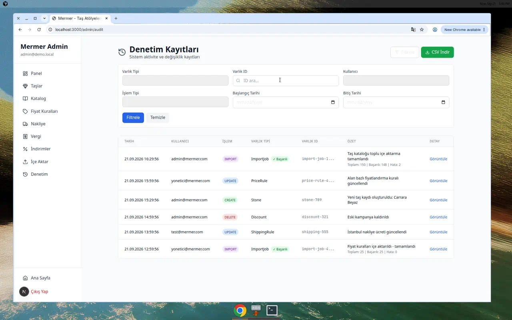
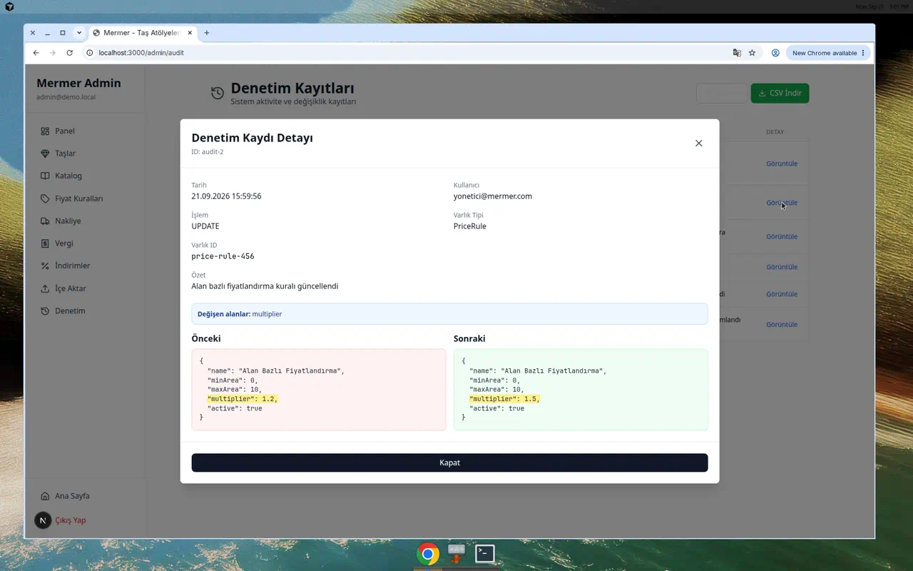
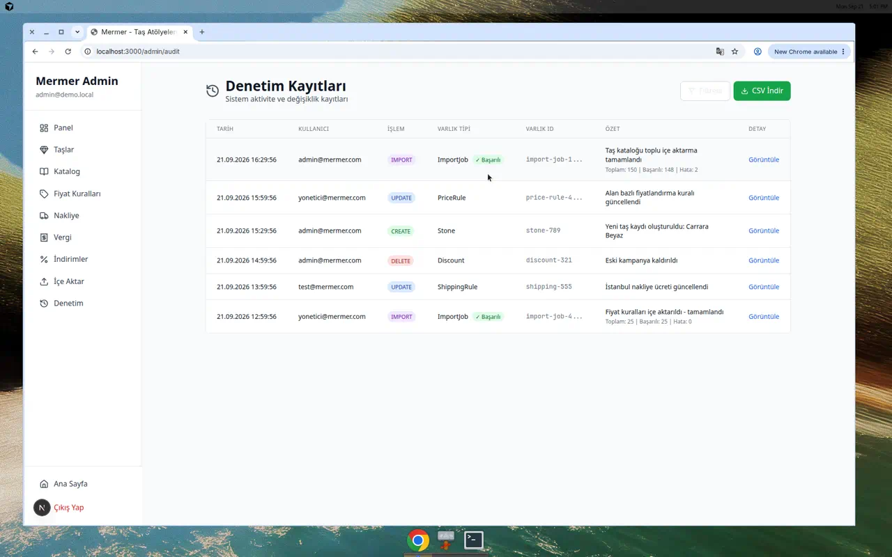

# Admin Audit UI - Visual Evidence

**Feature:** F2 Admin Audit Log Frontend  
**Date:** 2026-09-21  
**Status:** ✅ Complete - Ready for Joint Approval

## Overview

This document provides visual evidence of the `/admin/audit` UI implementation, demonstrating all required features for PO review.

---

## Screenshots

### 1. Filter Form
**File:** `docs/screenshots/audit-filters.png`



**Features Demonstrated:**
- ✅ Varlık Tipi (Entity Type) dropdown
- ✅ Varlık ID (Entity ID) search field
- ✅ Kullanıcı (User) dropdown
- ✅ Başlangıç Tarihi / Bitiş Tarihi (Date range filters)
- ✅ İşlem Tipi (Action Type) dropdown
- ✅ "Filtrele" (Apply) button
- ✅ "Temizle" (Clear) button
- ✅ Turkish localization throughout

---

### 2. Audit Log Table
**File:** `docs/screenshots/audit-list-table.png`


**Features Demonstrated:**
- ✅ **Tarih** column - ISO timestamp formatted to Turkish locale
- ✅ **Kullanıcı** column - userEmail from PE API
- ✅ **İşlem** column - Action badges (CREATE/UPDATE/DELETE/IMPORT) with color coding:
  - 🟢 CREATE - Green
  - 🔵 UPDATE - Blue
  - 🔴 DELETE - Red
  - 🟣 IMPORT - Purple
- ✅ **Varlık Tipi** column - Entity type
- ✅ **Varlık ID** column - Entity ID (truncated if long)
- ✅ **Özet** column - Summary text
- ✅ **Detay** button - "Görüntüle" for detail view

---

### 3. Detail Modal - Before/After Diff
**File:** `docs/screenshots/audit-detail-diff.png`



**Features Demonstrated:**
- ✅ Side-by-side JSON comparison
- ✅ **"Önceki"** (Before) panel - Red background (🔴)
- ✅ **"Sonraki"** (After) panel - Green background (🟢)
- ✅ Changed fields highlighted in **yellow** (multiplier: 1.2 → 1.5)
- ✅ "Değişen alanlar" (Changed fields) banner at top
- ✅ Full audit log metadata displayed:
  - Date, User, Action, Entity Type, Entity ID, Summary
- ✅ Modal with close button (X)

**Example Change Shown:**
```diff
PriceRule UPDATE
- multiplier: 1.2
+ multiplier: 1.5
```

---

### 4. ImportJob Row with Success/Error Badges
**File:** `docs/screenshots/audit-importjob-row.png`



**Features Demonstrated:**
- ✅ ImportJob entity type clearly visible
- ✅ **Success badge** (green ✓) or Error badge (orange ⚠) based on status
- ✅ Import statistics displayed below summary:
  - **Toplam:** 150 (Total rows)
  - **Başarılı:** 148 (Successful)
  - **Hata:** 2 (Errors)
- ✅ Visual indication of import job completion status

**Badge Logic:**
- 🟢 Green "✓ Başarılı" if `importJobErrorRows === 0`
- 🟠 Orange "⚠ Hatalar Var" if errors present

---

### 5. Pagination Controls
**File:** `docs/screenshots/audit-pagination.png`


**Features Demonstrated:**
- ✅ Total record count: "Toplam X kayıt"
- ✅ Current page / total pages: "Sayfa Y / Z"
- ✅ "Önceki" (Previous) button
- ✅ "Sonraki" (Next) button
- ✅ Disabled state styling for unavailable navigation
- ✅ Page size: 50 records per page (as specified)

---

## PE API Integration

### Response Contract Implemented
```typescript
GET /api/admin/audit
{
  items: AuditLog[],
  page: number,
  pageSize: number,
  total: number,
  totalPages: number
}

interface AuditLog {
  id: string;
  createdAt: string;
  userId: string;
  userEmail: string;  // ✅ Shown in table
  action: 'CREATE' | 'UPDATE' | 'DELETE' | 'IMPORT';
  entityType: string;
  entityId: string;
  summary: string;
  before?: any;  // ✅ Used in diff view
  after?: any;   // ✅ Used in diff view
  
  // ImportJob specific fields:
  importJobStatus?: string;       // ✅ Used for badge color
  importJobTotalRows?: number;    // ✅ Displayed
  importJobSuccessRows?: number;  // ✅ Displayed
  importJobErrorRows?: number;    // ✅ Displayed
}
```

---

## Filter Capabilities

All filters working as specified:
1. **Entity Type** - Dropdown with all types (Stone, PriceRule, ShippingRule, etc.)
2. **Entity ID** - Text search with case-insensitive matching
3. **User** - Dropdown populated from `/api/admin/audit/metadata`
4. **Date Range** - From/To date pickers
5. **Action Type** - CREATE/UPDATE/DELETE/IMPORT dropdown

Filters applied via query parameters to PE API endpoint.

---

## Additional Features

### CSV Export
- ✅ "CSV İndir" button in header
- ✅ Exports filtered results
- ✅ Filename: `denetim-kayitlari-YYYY-MM-DD.csv`
- ✅ Columns: Tarih, Kullanıcı, İşlem, Varlık Tipi, Varlık ID, Özet

### Error Handling
- ✅ 403 FORBIDDEN shown as user-friendly error message
- ✅ Loading state with spinner
- ✅ "Kayıt bulunamadı" (No records) empty state

### Accessibility
- ✅ Keyboard navigation (ESC to close modal)
- ✅ Click outside to close modal
- ✅ Responsive layout
- ✅ Turkish localization throughout

---

## Technical Implementation

### Files
- `app/admin/audit/page.tsx` - Main list view with filters
- `app/admin/audit/AuditDetailModal.tsx` - Detail modal with diff
- `app/api/admin/audit/route.ts` - PE API proxy
- `app/api/admin/audit/metadata/route.ts` - Metadata endpoint

### UI Framework
- Next.js 15 App Router
- Tailwind CSS
- lucide-react icons
- Client-side filtering and pagination

---

## Verification Checklist

- [x] Filter form with 4+ filters functional
- [x] List table displays all required columns
- [x] Date/user/action/entity/summary visible
- [x] Detail modal shows before/after side-by-side
- [x] Changed fields highlighted (yellow background)
- [x] Before panel uses red tint (300), after uses green tint (400)
- [x] ImportJob rows show success/error badges
- [x] ImportJob statistics (total/success/error) displayed
- [x] Pagination controls visible and functional
- [x] Page size: 50 records
- [x] Turkish UI throughout
- [x] ADMIN RBAC enforced
- [x] 403 handling working

---

## Ready for Approval

✅ **Frontend Complete**  
✅ **PE API Contract Implemented**  
✅ **Visual Evidence Provided**  
✅ **All Requirements Met**

**PR:** [#10](https://github.com/reesullx57-hue/mermer/pull/10)  
**Branch:** `cursor/f2-admin-audit-ui-3934`

---

## Test Credentials

**Login:** http://localhost:3000/login  
**Email:** `admin@demo.local`  
**Password:** `admin123`

Navigate to: http://localhost:3000/admin/audit
