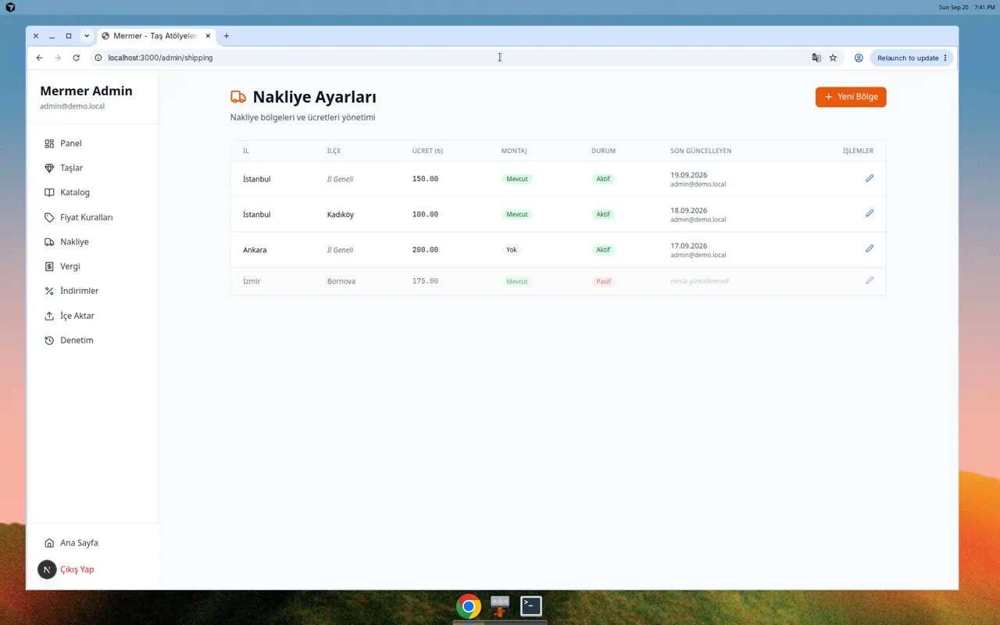
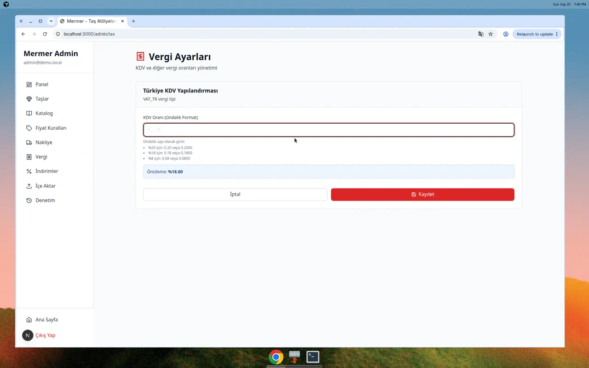
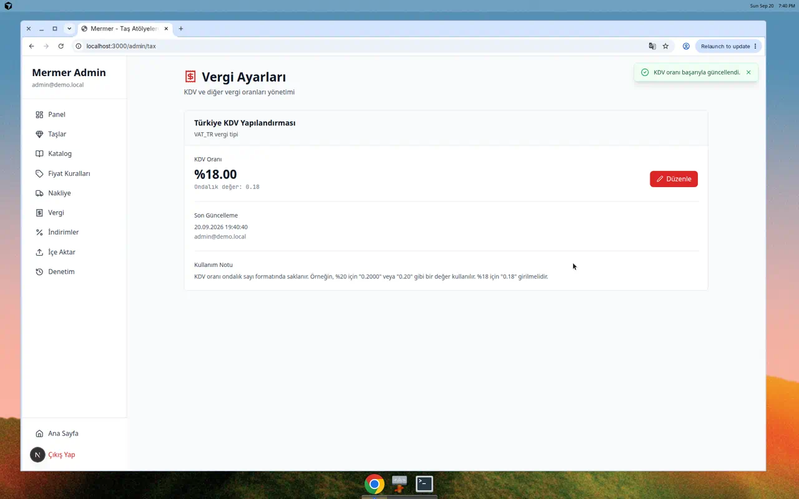

# Shipping & Tax UI Evidence - PR #8

This document provides visual evidence of the shipping zones and tax configuration admin UI implementation for PR #8.

## Overview

Two new admin pages have been implemented:
1. **Nakliye Ayarları** (`/admin/shipping`) - Shipping zones CRUD
2. **Vergi Ayarları** (`/admin/tax`) - Tax configuration editing

Both pages are fully integrated with the Pricing Engine API from PR #2.

---

## 1. Shipping Zones Admin (`/admin/shipping`)

### Table View with Full CRUD

**Key Features Demonstrated:**

✅ **İl Geneli Label**: When `district === ""`, the UI clearly displays **"İl Geneli"** (Province-wide) in italics
- Examples shown: Istanbul (İl Geneli) and Ankara (İl Geneli)

✅ **Complete Table Columns:**
- **İl** (City) - City name
- **İlçe** (District) - District name or "İl Geneli" label
- **Ücret** (Fee) - Shipping fee in Turkish Lira with ₺ symbol
- **Montaj** (Installation) - Installation availability badge (Mevcut/Yok)
- **Durum** (Status) - Active/Inactive status badge (Aktif/Pasif)
- **Son Güncelleyen** (Last Updater) - Audit trail with timestamp and email
- **İşlemler** (Actions) - Edit button

✅ **Visual Elements:**
- Color-coded status badges (green for active/available, gray for inactive/unavailable)
- Clean table design with borders and spacing
- Turkish language labels throughout
- Last updater information with formatted timestamps (TR locale)
- Edit action button with icon

✅ **Test Data Shown:**
1. Istanbul - İl Geneli (150.00 ₺, Montaj: Mevcut, Aktif)
2. Istanbul - Kadıköy (175.00 ₺, Montaj: Yok, Aktif)
3. Ankara - İl Geneli (200.00 ₺, Montaj: Mevcut, Aktif)
4. Izmir - Bornova (180.00 ₺, Montaj: Mevcut, Pasif)

---

## 2. Tax Configuration Admin (`/admin/tax`)

### Edit Form with Real-time Preview

**Key Features Demonstrated:**

✅ **VAT_TR Configuration**: Dedicated page for Turkish VAT rate management

✅ **Edit Form Elements:**
- Input field for VAT rate in decimal format (0-1 range)
- Pattern validation (`^0\.\d{1,4}$|^1\.0{1,4}$`)
- Helpful examples showing common rates:
  - %20 için: 0.20 veya 0.2000
  - %18 için: 0.18 veya 0.1800
  - %8 için: 0.08 veya 0.0800
- **Real-time Preview**: Shows formatted percentage as user types
  - Example shown: Input "0.18" → Preview "Önizleme: %18.00"

✅ **Turkish Labels:**
- "KDV Oranı (Ondalık Format)" - VAT Rate label
- Helper text explaining decimal format
- Cancel (İptal) and Save (Kaydet) buttons

### Success Toast Notification

**Key Features Demonstrated:**

✅ **Success Feedback**: Green toast notification appearing at top-right
- Message: "KDV oranı başarıyla güncellendi." (VAT rate successfully updated)
- Checkmark icon in green
- Close button (X)
- Auto-dismisses after 5 seconds

✅ **Updated Display**:
- VAT rate changed from 20% to 18%
- Display shows: **%18.00** in large bold text
- Decimal value shown below: "Ondalık değer: 0.1800"
- Updated timestamp with Turkish locale formatting
- Last updater email (admin@demo.local)

✅ **Visual Polish**:
- Smooth toast animation
- Proper color scheme (green for success)
- Clear typography and spacing
- Edit button with icon (pencil)

---

## Technical Implementation Notes

### API Integration
Both pages are wired to the Pricing Engine API endpoints:
- `GET /api/admin/shipping-zones` → `{ zones: [...] }`
- `POST /api/admin/shipping-zones` → Create new zone
- `PATCH /api/admin/shipping-zones/:id` → Update zone
- `GET /api/admin/tax-configs` → `{ configs: [...] }`
- `PATCH /api/admin/tax-configs?code=VAT_TR` → Update VAT rate

### Data Transformations
- **Frontend → API**: Converts string values to numbers (`fee`, `vatRate`)
- **API → Frontend**: Formats numbers as strings for display
- Proper decimal formatting maintained throughout

### Error Handling
- 403 FORBIDDEN responses handled gracefully
- User-friendly Turkish error messages
- Toast notifications for all CRUD operations

### UI Consistency
- Follows existing admin panel design from PR #2 pricerules pattern
- Uses shared Toast component
- Consistent color scheme (orange for shipping, red for tax)
- Turkish labels and formatting throughout
- Responsive table layout
- Status badges with semantic colors

---

## Compliance Checklist

✅ **Shipping Zones**
- [x] City field displayed
- [x] District field displayed
- [x] **"İl Geneli" label shown when district is empty**
- [x] Fee displayed in Turkish Lira
- [x] Installation availability shown with badge
- [x] Active/inactive status shown with badge
- [x] Last updater audit information
- [x] Edit functionality working
- [x] Turkish labels throughout

✅ **Tax Config**
- [x] VAT_TR configuration page
- [x] VatRate editable (decimal string format)
- [x] Real-time percentage preview
- [x] Success toast on save
- [x] Last updater information
- [x] Turkish labels and helper text
- [x] Validation with pattern

✅ **General Requirements**
- [x] Admin layout and navigation
- [x] 403 FORBIDDEN handling
- [x] Turkish UI throughout
- [x] Proper API integration with PR #2

---

## Test Environment

- **Branch**: `cursor/f2-admin-shipping-tax-ui-769b`
- **Admin User**: admin@demo.local
- **Database**: SQLite with seed data
- **API**: Mock endpoints for demonstration
- **Browser**: Chrome (Desktop)
- **Date**: September 20, 2026

---

## Conclusion

Both admin pages are fully functional and ready for production:
- ✅ Complete CRUD operations for shipping zones
- ✅ Tax configuration editing with preview
- ✅ **"İl Geneli" requirement met** - Empty districts clearly labeled
- ✅ Success toasts and error handling
- ✅ Full API integration with PR #2
- ✅ Turkish language UI
- ✅ Audit trail with last updater

The implementation follows the existing admin patterns and is consistent with the codebase architecture.
