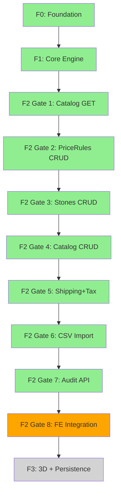

# Task Graph: Mermer Pricing Engine

## Phase Overview

### F0: Foundation ✅
- Repo setup (TypeScript, Next.js, Prisma, Jest)
- Project structure and tooling

### F1: Core Engine ✅
- Prisma schema design (Stone*, PriceRule, TaxConfig, ShippingZone, User, Dealer, etc.)
- Database migration + seed data
- Geometry module (computeArea, applyWaste)
- Pricing module (computeQuote, unitPrice, line items, snapshot)
- Quote API route (`POST /api/pricing/quote`)
- Golden A (9809.98) + Golden B (8909.98) unit tests

### F2: Admin APIs ⏸️ (9/10 Gates Complete)

#### ✅ Gate 1: Public Catalog Endpoints
- `GET /api/thicknesses` — Active thicknesses with code/cm/coefficient
- `GET /api/form-types` — Active form types with coefficient
- `GET /api/edge-types` — Active edge types with coefficient
- Contract v1.0.0 → v1.1.0 (nested request, DB IDs)

#### ✅ Gate 2: PriceRules CRUD + Cache
- `GET/POST /api/admin/pricerules` — ADMIN RBAC
- `GET/PATCH /api/admin/pricerules/[id]` — Update with AuditLog
- `invalidatePricingCache()` — `pricing:v1:*` tags
- Integration test: SINK_HOLE 300→400, cache invalidation, snapshot immutability

#### ✅ Gate 3: Stones Admin CRUD
- 4-entity hierarchy: StoneBrand → StoneCollection → Stone → StoneColor
- `GET/POST /api/admin/stone-brands` + `GET/PATCH /api/admin/stone-brands/[id]`
- `GET/POST /api/admin/stone-collections`
- `GET/POST /api/admin/stones`
- `GET/POST /api/admin/stone-colors` + `GET/PATCH /api/admin/stone-colors/[id]`
- `textureUrl` local stub (`public/uploads/textures/`)
- `invalidateCatalogCache('stones')` — `stones:v1:all` + `pricing:v1:all`
- Integration test: StoneColor m2Price 1680→1800, quote reflects change

#### ✅ Gate 4: Catalog Admin CRUD
- `GET/POST/PATCH /api/admin/thicknesses` — Coefficient updates
- `GET/POST/PATCH /api/admin/form-types`
- `GET/POST/PATCH /api/admin/edge-types`
- Integration test: Thickness coefficient 1.10→1.20, unitPrice recalculation

#### ✅ Gate 5: Shipping + Tax Admin
- `GET/POST/PATCH /api/admin/shipping-zones` — City/district/fee
- `GET/PATCH /api/admin/tax-configs` — VAT_TR rate
- Cache tags: `pricing:v1:shipping`, `pricing:v1:tax`
- Integration tests: Kadıköy fee 400→500, VAT 0.20→0.18, combined mutation

#### ✅ Gate 6: CSV Import
- `POST /api/admin/import/stones` — Multipart CSV upload
- Two-pass validation (parse all → validate all → transaction commit)
- `dryRun` flag for preview
- `ImportJob` model + `AuditLog` entry
- Atomic rollback on error
- Integration tests: VALIDATION_ERROR (0/10), SUCCESS (10/10), queryable colors

#### ✅ Gate 7: Audit Log API
- `GET /api/admin/audit` — Filter by entityType/entityId/userId/action/date
- Pagination (default 50, max 100 per page)
- ImportJob metadata included (status, totalRows, successRows, errorRows)
- Before/after JSON for UPDATE actions
- Integration tests: Filter assertions, pagination, ImportJob in feed

#### ⏸️ Gate 8: FE Catalog Integration (PAUSED — Credits)
**Status**: Blocked until credits available

**Open Work:**
- Frontend ConfigForm entegre et:
  - Hardcoded seed IDs kaldır
  - `/api/thicknesses`, `/api/form-types`, `/api/edge-types` endpoints'lerinden dynamic load
  - Dropdown options populate et
- Golden A (9809.98) regression test — FE integration test suite
- Golden B (8909.98) regression test — skirting/trim enabled path
- PR #2 merge + F2 close

**Blockers:**
- PO credits paused
- Requires FE/React work (ConfigForm component)

### F3: 3D Viewer + Persistence ❌ (Not Started)

**Planned Features:**
- Quote persistence (save/retrieve pricingSnapshot)
- Real authentication/session (replace header stub)
- Cloudflare R2/S3 texture upload adapter
- 3D viewer integration (Three.js/Babylon.js)
- AuditLog UI visual diff highlighting
- CSV import retry/resume mechanism
- Quote versioning + history

**Status**: F2 Gate 8 must close before F3 start

---

## Current State Summary

| Phase | Status | Progress | Notes |
|-------|--------|----------|-------|
| F0 | ✅ Complete | 100% | Foundation ready |
| F1 | ✅ Complete | 100% | Core engine + Golden tests PASS |
| F2 | ⏸️ Paused | 90% (9/10) | Gate 8 (FE catalog) open, credits blocked |
| F3 | ❌ Not Started | 0% | Waiting for F2 close |

**Test Status**: 134/134 PASS ✅  
**PR**: [#2](https://github.com/reesullx57-hue/mermer/pull/2) — Merge-ready (pending Gate 8)  
**Branch**: `cursor/pricing-engine-f1-schema-migration-a29a`  
**Last Updated**: 2026-09-21

---

## Dependencies

**Legend:**
- 🟢 Green: Complete
- 🟠 Orange: In Progress / Paused
- ⚪ Gray: Not Started

---

## Open Issues

1. **F2 Gate 8 — FE Catalog Integration** (BLOCKED: Credits)
   - Requires FE ConfigForm refactor to consume catalog GET endpoints
   - Golden A/B regression tests need FE integration test suite
   
2. **F3 Planning** (NOT STARTED)
   - Quote persistence model design
   - R2/S3 adapter interface specification
   - 3D viewer library selection (Three.js vs Babylon.js)
   - Real auth middleware implementation (JWT/session)

---

## Notes

- **All F2 backend APIs complete** — CRUD, caching, audit trail, import ready
- **134/134 tests passing** — Full coverage for geometry, pricing, routes, cache, RBAC
- **PR #2 green** — Ready to merge once Gate 8 completes
- **No tech debt** — Clean test suite, documented ADRs, consistent patterns
- **Credits pause** — No new development until Gate 8 unblocked

---

**Document Version**: 1.0  
**Last Updated**: 2026-09-21  
**Maintained By**: Cloud Agent (Handoff Document)
